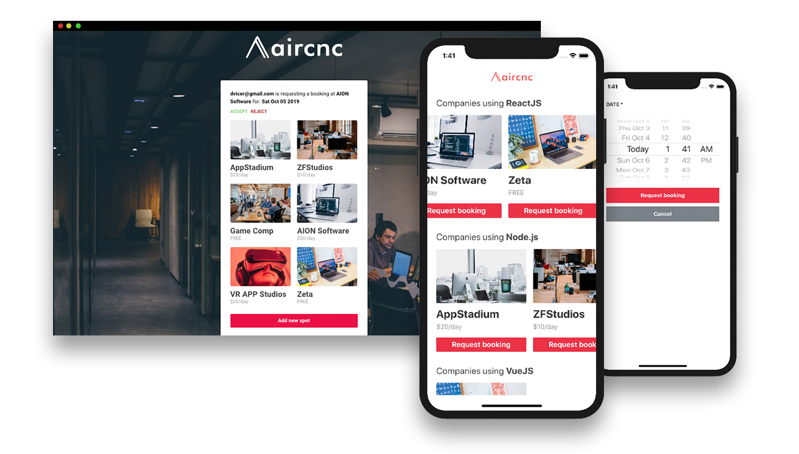

  

Projeto baseado no Airbnb, o Aircnc(Air Coffee And Code) foi feito na intenção de registrar spots para programadores(Projeto feito durante a semana Omnistack da Rocketseat).

 
  
# Stack

- Web
  - \* [check package.json](/web/package.json)

- Mobile
  - \* [check package.json](/mobile/package.json)  

- Server
  - \* [check package.json](/server/package.json)

# License
[MIT License](https://github.com/marcosapj2/aircnc/blob/master/LICENSE)
